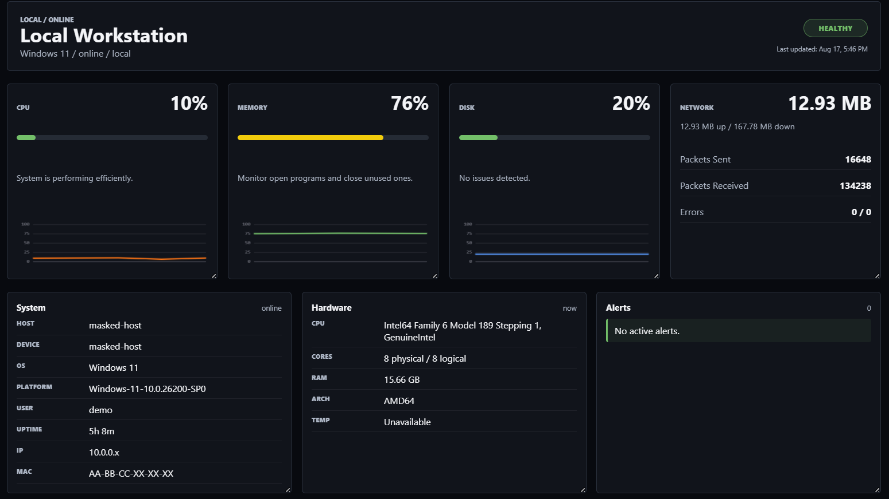
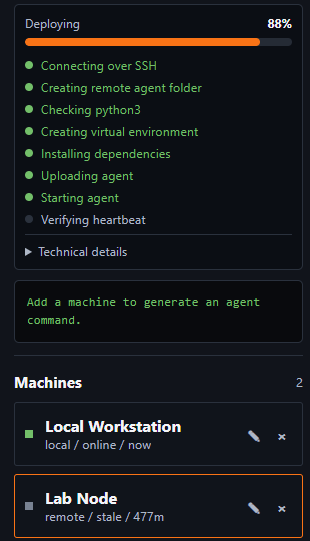
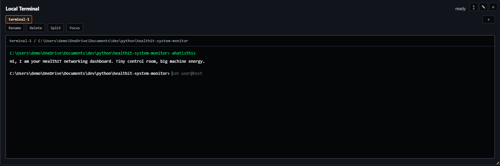
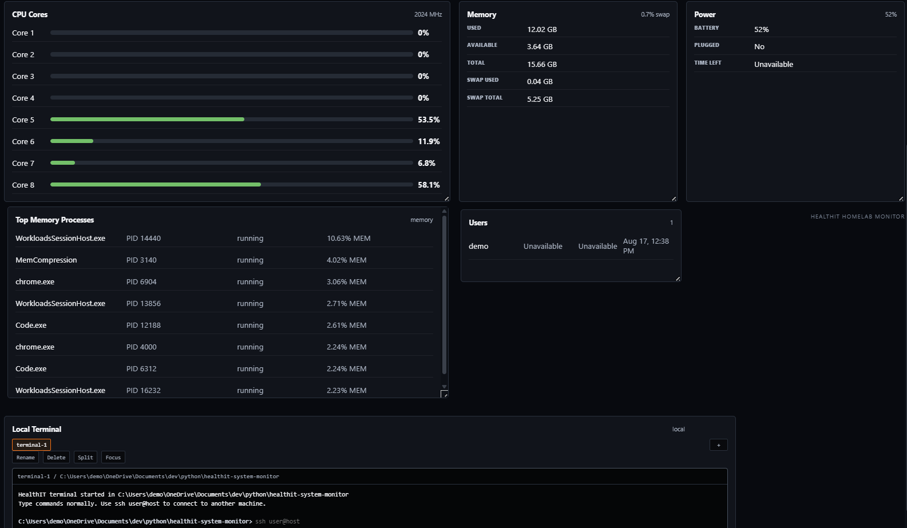

# HealthIT Monitor

A simple homelab dashboard for watching computers on your network.

HealthIT Monitor lets you run a dashboard on one computer, connect other machines to it, and see their system stats in one place. It is meant for Raspberry Pis, laptops, servers, repair machines, or any small lab setup where you want a quick view of what is happening.

## Preview

### Dashboard Overview



### Agent Deploy Flow



### Local Terminal



### System Details



## What It Does

- Shows CPU, memory, disk, network, uptime, hardware, users, power, and process info.
- Monitors the computer running the dashboard.
- Can deploy a small Python agent to another machine over SSH.
- Shows remote machines as they send telemetry back.
- Includes a local browser terminal for dashboard-side commands.
- Uses a dark, Grafana-style dashboard layout.

## Setup

Clone the repo:

```powershell
git clone https://github.com/SantiagoCarbajal016/healthit-system-monitor.git
cd healthit-system-monitor
```

Create a virtual environment:

```powershell
python -m venv .venv
.\.venv\Scripts\Activate.ps1
```

Install dependencies:

```powershell
python -m pip install -r requirements.txt
```

Optional: copy the example env file if you want local settings:

```powershell
copy .env.example .env
```

Run the dashboard:

```powershell
python -m uvicorn backend.Health_Logger:app --host 0.0.0.0 --port 8000
```

Or use the Windows helper:

```powershell
.\start.ps1
```

Open the app:

```text
http://127.0.0.1:8000/app
```

Before taking screenshots, use **Mask Info** in the sidebar to hide usernames, IPs, MACs, and local paths.

## Connecting Another Machine

Run the dashboard on your main computer with:

```powershell
python -m uvicorn backend.Health_Logger:app --host 0.0.0.0 --port 8000
```

In the dashboard, use **Add Machine** and enter:

- Machine name
- IP address or hostname
- Controller URL, like `http://YOUR-DASHBOARD-IP:8000`
- SSH username
- SSH port, usually `22`
- SSH password or SSH key mode

Then click **Deploy**.

The app will SSH into the machine, create `~/healthit-agent`, install the agent dependencies, start the agent, and wait for the first heartbeat.

Machines and recent dashboard state are saved locally in SQLite under `data/`.

For more detail on where this app should run, see [docs/deployment.md](docs/deployment.md).

## Manual Agent Run

You can also run the agent yourself on another computer:

```powershell
python agent.py --server http://YOUR-DASHBOARD-IP:8000 --name Lab-Node-01 --tag homelab
```

## Tests

```powershell
python -m pytest
```

## Notes

- This is built for trusted local networks and homelab testing.
- Do not expose it directly to the public internet yet.
- SSH passwords are not stored.
- SSH keys are recommended for long-term use.
